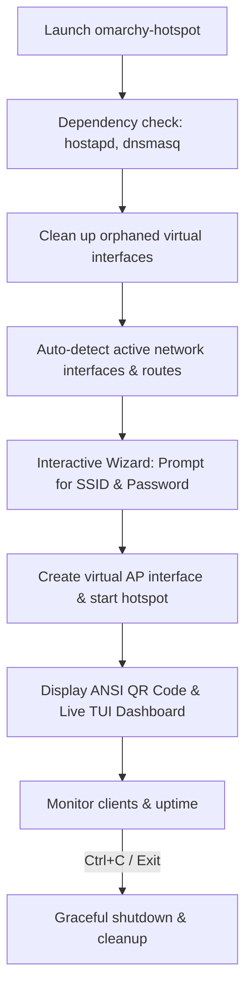

# Project Report: Rust-Based Interactive Hotspot Manager (omarchy-hotspot)

## 1. Executive Summary
This report outlines the design, architecture, and implementation plan for `omarchy-hotspot` (tentative name), an interactive, terminal-based Wi-Fi hotspot manager written in Rust. 

The project arose from a real-world troubleshooting session on an Arch Linux (Omarchy) system running the Hyprland window manager. The goal is to eliminate the complexity of manual hotspot configuration, automate system fixes, and deliver a premium, user-friendly CLI/TUI experience.

---

## 2. Background & Problem Statement
Minimalist Linux distributions (such as Arch Linux configured with Wayland compositors like Hyprland) lack unified desktop environment settings panels. Network configuration falls back to command-line tools or terminal interfaces:

1. **Fragmentation of Backends:** NetworkManager is often configured with the `iwd` (Intel Wireless Daemon) backend for client connections, which has limited support for sharing internet/hotspots via standard `nmcli` tools, resulting in failures like `802.1X supplicant failed`.
2. **Fragile Shell Utilities:** Legacy tools like `create_ap` are written in Bash. They are prone to runtime syntax failures (e.g., decimal-point parsing errors when scanning hardware frequencies like `2412.0 MHz`) and require manual code patching by end users.
3. **Hardware Interface Limits:** Wi-Fi cards limit the concurrent virtual interfaces (typically up to 3). Unclosed or crashed hotspot sessions leave orphaned interfaces (`ap0`, `ap1`, etc.) active, causing subsequent attempts to fail with `Device or resource busy`.
4. **Poor User Experience:** Users must manually query interfaces (`iw dev`), check routes (`ip route`), input long device strings, and type complex passwords on their mobile phones.

---

## 3. The Vision: Why Rust?
Rust is chosen as the implementation language for several key reasons:
* **Zero-Cost Abstractions & Performance:** Fast execution and low resource usage on lightweight systems.
* **Robust Error Handling:** Rust's type system (`Option`, `Result`) prevents unexpected shell crashes.
* **TUI Ecosystem:** Mature libraries (like `ratatui`) allow for rich, interactive, and beautiful terminal interfaces.
* **Safety:** Elimination of shell injection risks and parsing vulnerabilities common in Bash scripts.

---

## 4. System Architecture & Features

### Workflow Architecture

### Key Features
1. **Interactive Config Wizard:** Users are guided through selecting the sharing mode (e.g. Wi-Fi sharing to Wi-Fi, or Ethernet sharing to Wi-Fi) with smart auto-detected defaults.
2. **Auto-Cleanup Daemon:** Checks for existing `ap*` interfaces and cleanly deletes them via netlink/iw before launching.
3. **ANSI QR Code Generator:** Renders a QR code in the terminal. Scanning it with a mobile phone automatically connects it to the Wi-Fi network without typing.
4. **TUI Live Dashboard:** Displays active leases (`/var/lib/misc/dnsmasq.leases`), data usage rates, and connection status.

---

## 5. Technology Stack & Crates
The application will leverage the following crates:
* **`ratatui`**: Controls the layouts, widgets, and live dashboard UI.
* **`crossterm`**: Manages terminal events, raw mode, and screen cleanup.
* **`dialoguer`**: Prompts the user cleanly for SSID/Passwords with secure input masking.
* **`qrcode-generator`**: Builds the string matrices for terminal QR rendering.
* **`sysinfo` / `nix`**: Interacts with the host OS, network interfaces, and processes.

---

## 6. Implementation Roadmap

### Phase 1: Core Automation (CLI)
* Interface detection using `/sys/class/net` and route detection.
* Automated cleanup of existing virtual interfaces (`ap*`).
* Spawning and monitoring `create_ap` or native `hostapd`/`dnsmasq` processes.

### Phase 2: User Interface (TUI)
* Integrating `dialoguer` for user configuration inputs.
* Integrating `qrcode-generator` to display connection QR codes.
* Graceful shutdown hooks (`ctrlc` crate) to ensure interfaces are always deleted on exit.

### Phase 3: Live Monitoring
* Parsing `/var/lib/misc/dnsmasq.leases` to display connected mobile devices.
* Integrating `ratatui` for a real-time status window.
